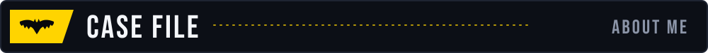
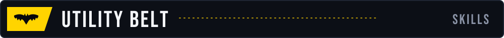
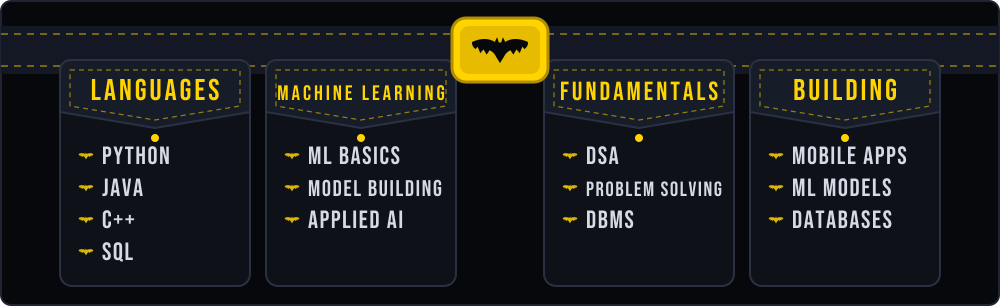
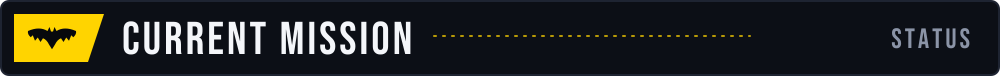
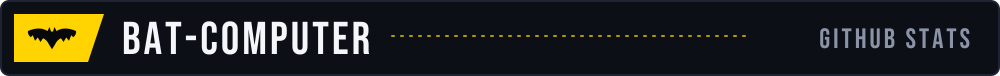
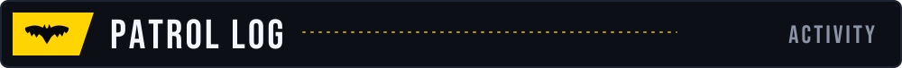
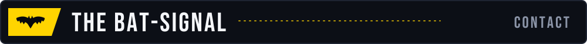

<div align="center">





<br>


<a href="https://github.com/Neverfinished005?tab=followers"></a>

</div>

<br>



```yaml
codename:            Neverfinished005
real_name:           Rudra Vable
base_of_operations:  Vadodara, Gujarat, India
role:                Aspiring Software Developer
specialties:         Python, Machine Learning, SQL, DSA, Mobile Apps
origin_story:        Academic and personal projects
status:              Open to SDE / ML & AI opportunities
```

I'm an aspiring software developer building a strong foundation in **Python, Machine Learning, SQL, Data Structures & Algorithms, and Mobile App Development**. I enjoy building practical solutions, exploring AI technologies, and creating applications that deliver real value.

My experience so far comes from academic and personal projects: machine learning models, database management, and mobile applications. I'm committed to continuous learning, and I'm looking for opportunities to contribute, learn from experienced professionals, and grow as a software engineer and AI practitioner.

<br>





<div align="center">

</div>

<br>



```
> Sharpening core ML and DSA fundamentals
> Building projects across mobile apps, ML, and data-driven tools
> Open to Software Development / ML & AI opportunities
```

<br>



<div align="center">


<br>


</div>

<br>



<div align="center">


</div>

<br>



<div align="center">

<a href="https://www.linkedin.com/in/rudra-vable/"></a>
<a href="https://github.com/Neverfinished005"></a>
<a href="mailto:vablerudra007@gmail.com"></a>

<br><br>



</div>
